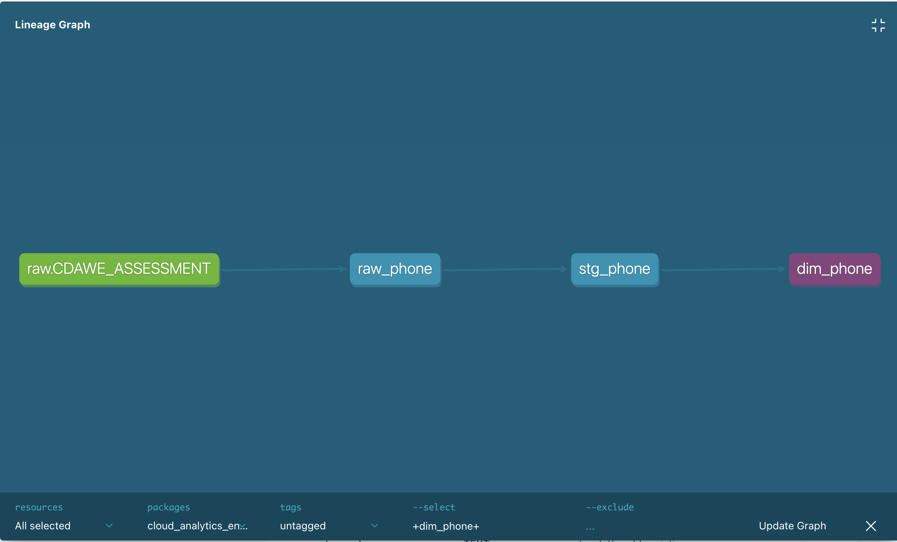

# Cloud Anlaytics Engineer Assessment

## Assumptions

1. CDAWE_assessment.csv contains no additional fields for establishing dates of duplicate phone numbers entered, dates for file upload or any other details that could be used to perform incremental updates.
2. I approached this project with the Kimball Star Schema methodolgy of facts and dimensions.  It is a foundational data wharehousing technique and is accepted throughout the industry.
3. Normalization was requested in the assessment but I don't believe it is the optimal approach.  If this table is to reside in Snowflake, it should take advantage of columnar DWH architecture.  Each column contains relatively small datatypes and the storage cost of creating a second dim table would be neglible, as would keeping the columns in the same table in a OBT or One Big Table format.  The cost of joining the two (or more) tables repeatedly would add cost to the analytics compute spend.  I recommend using the OBT approach and leaving all fields in the same table.  That being said, if another table were to be created to enrich or compliment the current table, I would recommend splitting the country code off and potentially adding a free share from Snowflake Marketplace such as the ISO country codes to standardize the codes and provide a more fullsome picture for analysts to draw from.
4. BI tool is capable of ingesting a view and doesnt require a table.
5. Phone numbers needed to be numeric and not contain -, # or any other special characters, including scientific notation.
6. Phone numbers that were < 1,000,000 were invalid. Suspected large phone numbers were left as is and would be investigated for additional source validation.

## Approach

1. Establish source, stage and marts layers. 
2. Ingest source csv via `dbt seed` into raw table
3. Create a materialized table to capture the source data
4. Create a stage table to effect cleaning and slight modifications to data type
5. Create a dimension view over the stage table to implement final buisness logic.  For this assessment, I chose a secure view in order to allow for a share to be created in Snowflake (regular views are not shareable).  The business logic I chose to implement was to keep only the latest account number and associated id and primary phone number.
6. Implement a .yml file per model rather than one per folder or project.  In this assessment it isn't necessary but it is a good practice.  It allows for model granularity when models become very complex.
7. Run all models and verify build with `dbt build --full-refresh`
7. Generate documentation via `dbt docs generate` command.
8. Inspect the output and revise.

## Potetial Improvements
1. Source validation would be the primary improvement with testing to ensure that phone numbers were valid per the country code. Duplicates would be managed by CDC processes or by implementing snapshotting or SCD Type 2 table.
2. Implement feature branches and multiple environments (sandbox, dev, prod) with github actions managing ci/cd to ensure production safety and automated checks for development issues.
3. Orchestration via Airflow or integration via Fivetran could allow for automated ingestion and incremental updates.  

## Lineage graph

